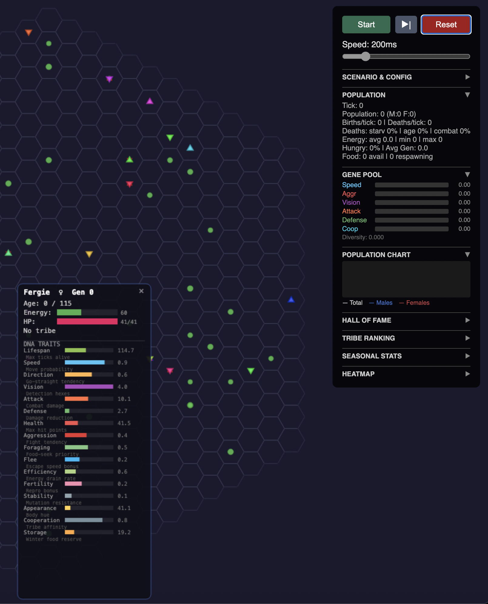
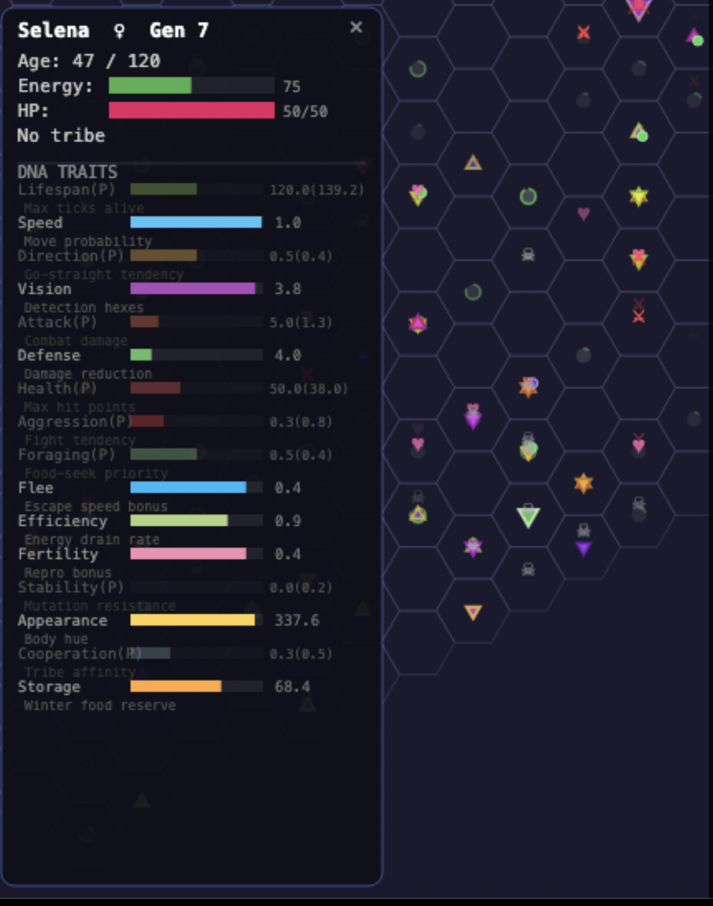
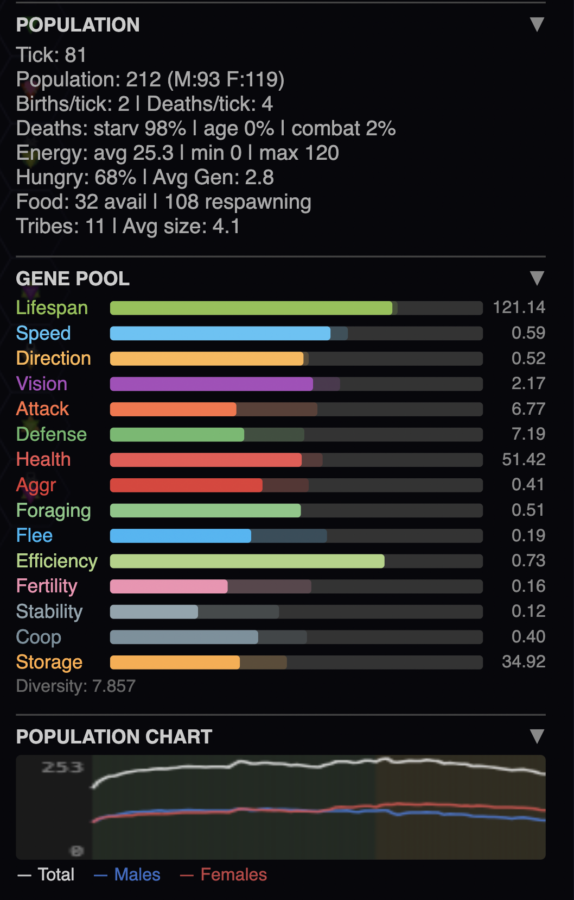
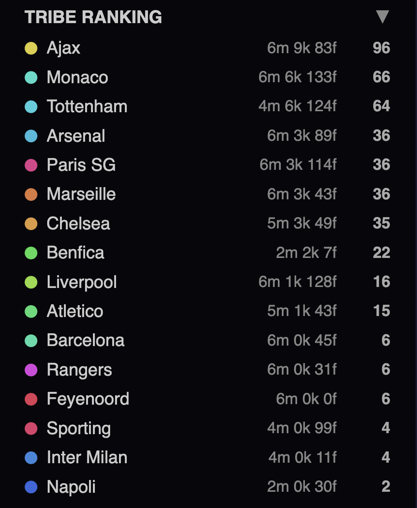
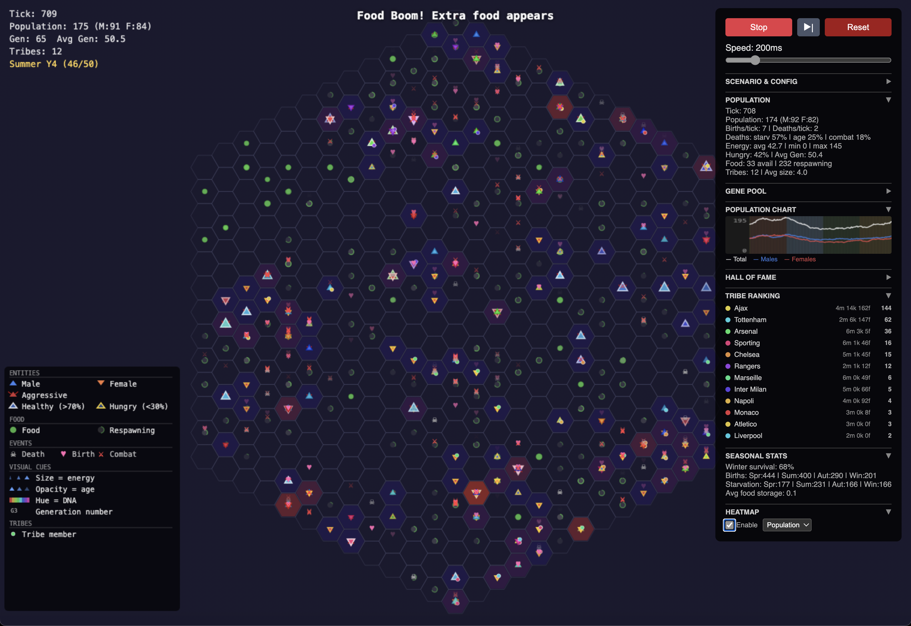
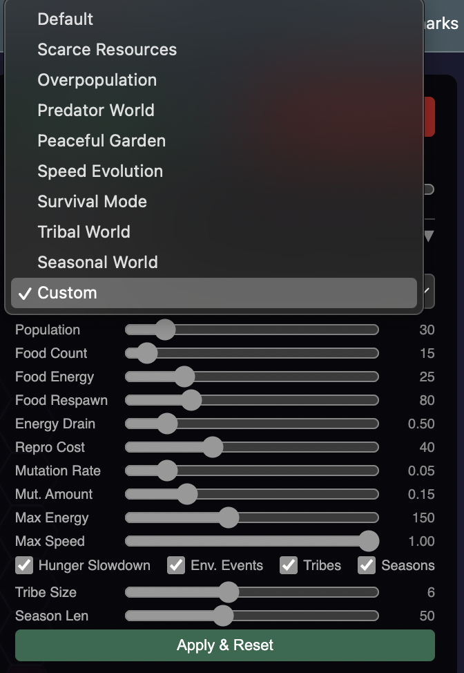
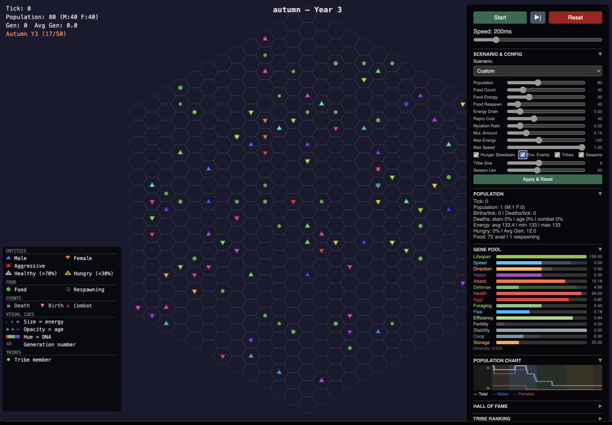
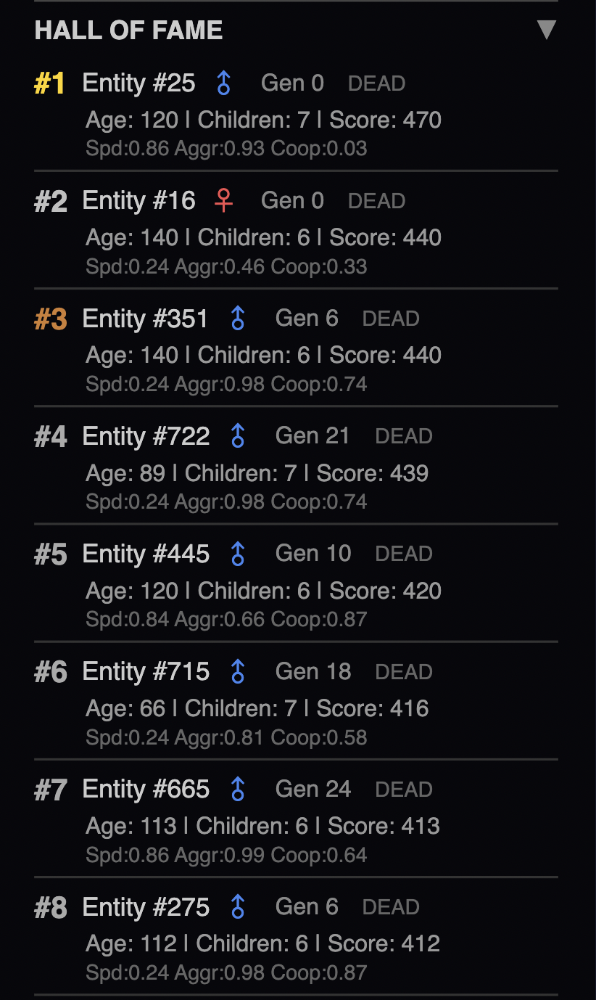
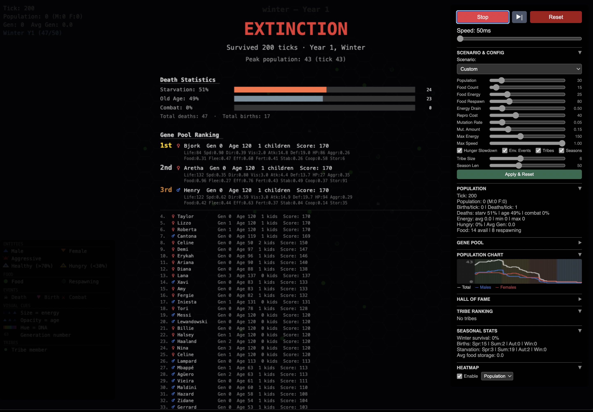

# Hex Life Simulation

An evolutionary life simulation on a hexagonal grid, built with TypeScript and HTML5 Canvas. Watch natural selection shape populations in real time as entities with DNA-encoded traits compete, cooperate, and evolve across generations.

## Inspiration

This project was inspired by Prof. Andrzej Dragan's book *Quo Vadis*, where he described a programming experiment simulating evolution through simple rules and emergent behavior. The idea that complex evolutionary dynamics — natural selection, genetic drift, cooperation, and competition — can arise from basic programmatic rules served as the foundation for this simulation. What started as a curiosity about artificial life became a fully interactive evolution sandbox where you can observe how populations adapt to environmental pressures, form tribal alliances, and develop specialized survival strategies over hundreds of generations.

## How It Works

### The World

Entities live on a hexagonal grid. Each tick of the simulation, they age, lose energy, make decisions about movement, eat food, fight, and reproduce. When all entities die, the simulation ends and you see a detailed post-mortem of what happened.



### DNA & the Active/Passive Gene System

Every entity carries a 16-gene DNA strand encoding traits like speed, vision range, attack power, aggression, cooperation, and more. But here's the twist — only **8 of the 16 genes are active** (expressed) at any time. The other 8 are **passive** — they're carried silently in the genome, inherited by offspring, but don't affect the carrier's behavior. This mimics how recessive genes work in real biology.

- **Active genes** use their real DNA-decoded values to drive behavior
- **Passive genes** use neutral defaults (the entity functions normally, just without specialization)
- **Hue** (body color) is always active — it's cosmetic and keeps entities visually distinct
- Activation patterns are **inherited** alongside DNA through crossover and mutation

This creates a hidden reservoir of genetic potential. A population might carry strong combat genes silently for generations until activation patterns shift and suddenly express them.



### Population Dynamics & Gene Pool

The sidebar tracks population statistics in real time: male/female ratios, birth and death rates, energy levels, and food availability. The **Gene Pool** section shows average trait values across the living population with colored bars. Behind each bar, a faint "ghost bar" reveals the **carried average** — the true genetic potential hidden in passive genes.



### Tribes & Cooperation

Entities with high cooperation genes (> 0.4) naturally form **tribes** when adjacent to each other. Tribes are named after famous football clubs — Ajax, Arsenal, Barcelona, Liverpool, and more. Tribe members share food, defend each other in combat, and move toward their tribe's centroid for social cohesion.

Tribes are enabled by default, making the cooperation and storage capacity genes meaningful from the start. Low-cooperation entities may voluntarily leave tribes, and tribes dissolve if all members drift too far apart.



### Environmental Events & Seasons

The simulation features a cyclical **season system** (spring, summer, autumn, winter). Spring spawns bonus food, winter slows food respawn. Environmental events like food booms and droughts add unpredictability. The banner at the top announces season changes and events.



### Scenarios & Configuration

Choose from preset scenarios (Scarce Resources, Predator World, Peaceful Garden, etc.) or fine-tune every parameter: population size, food count, energy drain, mutation rates, and more. Toggle hunger slowdown, environmental events, tribes, and seasons independently.





### Hall of Fame

The simulation tracks every entity's legacy. The **Hall of Fame** ranks entities by a score combining age and offspring count. Top performers get detailed gene breakdowns showing what made them successful.



### Extinction & Post-Mortem

When the population goes extinct, a detailed **end screen** analyzes what happened: death cause breakdown, gene pool ranking of the most successful entities, tribe legacy, seasonal summary, gene evolution (comparing initial vs final expressed vs final carried averages), and a population timeline.



### Selection Pressure

Several genes have enhanced selection pressure to make evolution more visible:

- **Direction Bias** — low values cause entities to stumble randomly instead of moving toward targets
- **Flee Speed** — entities with flee speed >= 0.3 take a double step away from threats, making flight a viable survival strategy
- **Storage Capacity** — stored food passively recovers energy each tick, turning storage into a metabolic reserve
- **Vision Range** — entities with vision >= 3 use food-density scanning, choosing the direction with the most food rather than just the nearest

## Features

- **Hexagonal grid** with configurable radius
- **16-gene DNA** with active/passive expression system
- **Reproduction** with crossover, mutation, and activation inheritance
- **Combat** with attack/defense rolls and tribal ally bonuses
- **Tribes** named after football clubs with food sharing and mutual defense
- **Seasons** with cyclical effects on food and survival
- **Environmental events** (food booms, droughts)
- **Visual differentiation**: sex (blue/red triangles), energy borders, aggression spikes, age opacity, DNA hue lineages, tribe dots
- **Entity inspector** with active/passive gene display
- **Analytics panel** with gene pool (expressed + carried ghost bars), population chart, Hall of Fame, tribe ranking, seasonal stats
- **Heatmap overlay** (population, food, combat density)
- **End screen** with gene evolution comparing expressed vs carried averages
- **Animated effects** for deaths, births, and combat

## Tech Stack

- TypeScript (ES2022)
- Vite (dev server + bundler)
- HTML5 Canvas (zero dependencies)

## Getting Started

```bash
npm install
npm run dev
```

Open `http://localhost:5173` in your browser.

## Controls

- **Space** — start/stop simulation
- **Right Arrow** — step one tick
- **H** — toggle heatmap overlay
- **Click entity** — inspect DNA traits and stats
- **Speed slider** — adjust tick interval (50-1000ms)
- **Reset** — restart with fresh population

## Project Structure

```
src/
  core/
    types.ts             # Shared interfaces (EntityState, FoodState, HexCoord)
    constants.ts         # DNA ranges, passive defaults, activation constants
    HexGrid.ts           # Hex coordinate math and grid operations
    DNA.ts               # Gene encoding, crossover, mutation, activation system
    Entity.ts            # Entity factory with gene activation
    Food.ts              # Food creation, consumption, respawn
    Tribe.ts             # Tribe registry, football team names, membership
    Seasons.ts           # Season cycle manager (spring/summer/autumn/winter)
    SimulationConfig.ts  # Configuration presets and builder
    SimulationEngine.ts  # Core tick loop with selection pressure mechanics
    GameLoop.ts          # RAF loop, tick timing, renderer orchestration
    Analytics.ts         # Statistics, gene tracking (expressed + carried), Hall of Fame
  rendering/
    Renderer.ts          # Main renderer orchestrating sub-renderers
    HexRenderer.ts       # Grid drawing with cached ImageData
    EntityRenderer.ts    # Entity triangles with visual encoding
    FoodRenderer.ts      # Food circles with pulsation
    EffectsRenderer.ts   # Floating emoji effects
    Inspector.ts         # Entity detail panel with active/passive display
    EndScreen.ts         # Post-extinction analysis screen
    UIOverlay.ts         # HUD stats + visual legend
  ui/
    Controls.ts          # DOM control panel with analytics and sparkline
  main.ts                # Entry point
```

## License

MIT
